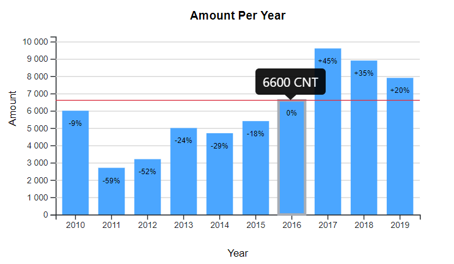

# D3Charts

Interactive web graphics written with [d3.js](https://d3js.org/). Customizable and user friendly interface for drawing d3 graphs. 

## Getting Started

See [demo](./demo/index.html) page for examples. 

### Dependencies

Requires [d3.js](https://d3js.org/) at least version 4. Copy [src](/src/.) to your project and include following references to your page

```
<script src="https://d3js.org/d3.v5.min.js"></script>
<script src="./src/d3Charts.js"></script>
<script src="./src/d3Table.js"></script>
```

**Note!** Currently displaying tooltips requires also that [Bootstrap](https://getbootstrap.com/docs/4.3/getting-started/introduction/) is installed. Except that works just fine without Bootstrap.

### Data

Initialize your data into following format

```
let data = [
    {"category":"category1","series":{"serie1":71, "serie2": 46}},
    {"category":"category2","series":{"serie1":65, "serie2": 49}},
    {"category":"category3","series":{"serie1":54, "serie2": 53}}
    ]
```

### Drawing

Call appropriate javascript function for drawing the chart 

| Function | Description | 
| -------- | ----------- | 
| drawBarChart | Bar chart | 
| drawLineChart | Line chart | 
| drawPieChart | Pie chart | 


For example:

```
drawBarChart(div = <id of your div>, data = data, opt = {})
```

### Customization

By adding an extra parameter `opt` you can customize your chart.

List of all possible parameters that can be defined

| Parameter | Description | Example | Default | Applies to |
| ------- | -------- | -------- | -------- | -------- |
| fontFamily | Font style |  | `Helvetica` | All |
| title | Main title of the chart |  | - | All |
| width | Width of the element |  | `500` | All |
| height | Height of the element |  | `300` | All |
| margin | Dict of marginals |  | `{top: 50, bottom: 50, left: 50, right: 50}` | All |
| responsiveness | Boolean for applying responsive behaviour | `true/false`  | `false` | All |
| xlabel | X-axis label options | `{label:'Year', size:12, fontWeight: 'normal'}` | - | BarChart, LineChart |
| ylabel | Y-axis label options | `{label:'Amount', size:12, fontWeight: 'normal'}` | - | BarChart, LineChart |
| y2label | Secondary Y-axis label options | `{label:'Costs', size:12, fontWeight: 'normal'}` | - | BarChart, LineChart |
| xaxis | X-axis options | `{font: {size: 12}, orientation: 'vertical/skew/horizontal'}` | `{font: {size: 10}, orientation: 'horizontal'}` | BarChart, LineChart |
| yaxis | Y-axis options |  | `{font: {size: 10}, min:10, max:200}` | BarChart, LineChart |
| y2axis | Secondary Y-axis options. serieIndex list the serie indexes that applies to secondary axis | `{serieIndex:[1,2] , font: {size: 10}, min:10, max:200}` | `false` | BarChart, LineChart |
| colors | List of colors for each serie | `['#4BA6FF','#0bef41']` | [d3.schemeCategory10](https://github.com/d3/d3-scale-chromatic/blob/master/README.md#schemeCategory10) | All |
| padding | Padding between bars |  | `0.1` | BarChart |
| barlabel | Options for bar labels | `{size:10, color:'#fff'}` | `false` | BarChart |
| traceDiff | Possibility to track percent differences between bars | `{size:10, color:'black'}` | `false` | BarChart |
| tooltip | Show tooltips. Requires Bootstrap. | `true/false` | `false` | All |
| avgLine | Show average line with options | `{size:10, color: '#DC3545', prefix: "ka ", suffix:"h"}` | `false` | BarChart |
| legend | Show legend with options | `{coord: {x: 620, y: 50}, rect: {size: 10, space: 5}, font: {size: 12}}` | `false` | All |
| grid | Show/Hide grid | `true/false` | `false` | BarChart, LineChart |
| ticks | Number of x-axis ticks | `ticks: {count:5}` | Data length | BarChart, LineChart |
| animation | Animation settings | `{duration: 500, delay: 20}` | `false` | BarChart |
| slicelabel | Show/Hide slice labels | `true/false` | `{size:10, color:'#fff', threshold: 0.10}`| PieChart |
| radius | Pie chart radius | `{inner: 20, outer: 100` | `{inner: 0, outer: (height - margin.top - margin.bottom) / 2}` | PieChart |
| maxSliceCount | Maximum number of slices |  | `20` | PieChart |
| line | Options for line |  | `{width: 2}` | LineChart |
| circle | Show/Hide circles in line |  | `{radius: 4, display: false}` | LineChart |

## Examples

### Bar Chart



### Line Chart


### Pie Chart


## D3Table

In addition to charts there is also possibility to create interactive tables.

### Getting Started

Initialize your data into following format

```
let data = [
    {"ColumnA":29.0,"ColumnB":23.0,"ColumnC":17.0},
    {"ColumnA":23.0,"ColumnB":26.0,"ColumnC":19.0},
    {"ColumnA":24.0,"ColumnB":21.0,"ColumnC":21.0}
    ]
```

Create table with following command

```
createTable(div = '<id of your div>', dataset = data, opt={})
```

### Customization

By adding an extra parameter `opt` you can customize your table.

List of all possible parameters that can be defined

| Parameter | Description | Example | Default | 
| ------- | -------- | -------- | -------- |
| fontFamily | Font style |  | `Helvetica` |
| width | Width of the element | `500` | `100%` | 
| height | Height of the element | `200` | `100%` |
| sort | Enable/Disable sorting | `true/false` | `false` |
| border | Show/Hide sorting | `true/false` | `false` |
| padding | Padding for cells | `10px` | `5px` |
| hover | Hover rows on mouseover | `true/false` | `false` |
| font | Font options | `{size: '12px'}` | `{size: '14px'}` |
| textAlign | Text alignment  | `center/left/right` | `center` |
| header | Options for header row | `{color:'#000', backgroudColor: '#e9ecef'}` | `{color:'#000', backgroudColor: '#e9ecef'}` |
| footer | Footer options and aggregation functions applied | ` {color:'#000', backgroudColor:'#e9ecef', columns: {1: 'mean', 2: 'mean', 3:'sum', 4:'sum'}}` | `false` |

### Example

